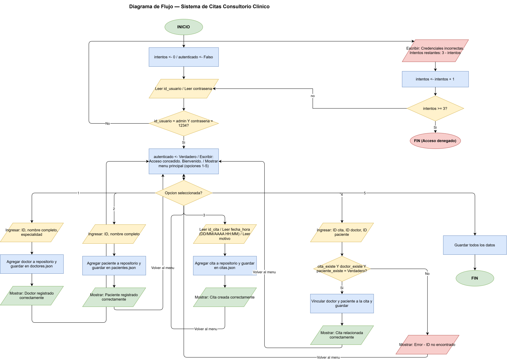
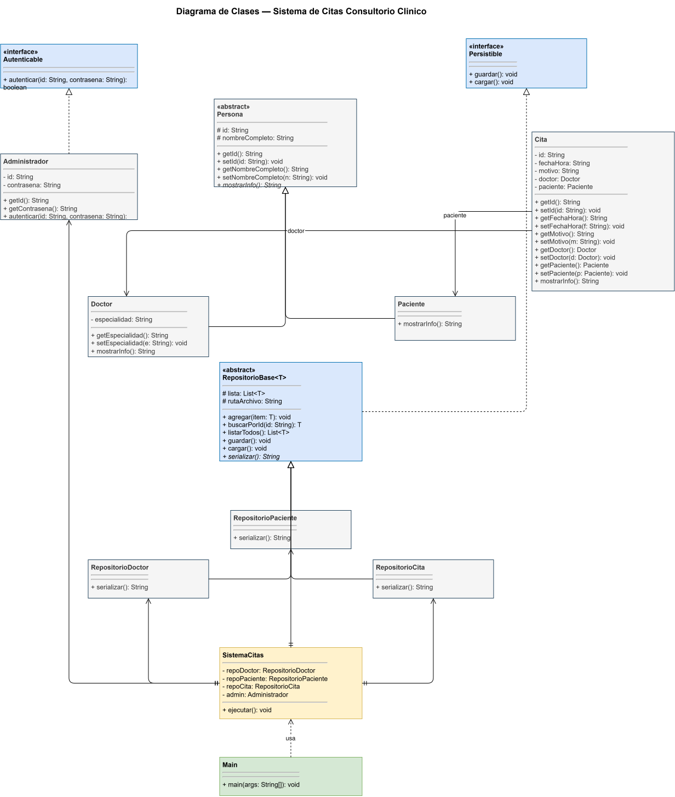

# Proyecto

## Diagrama de Flujo

El siguiente diagrama describe el flujo completo del programa, desde el inicio de sesión hasta la salida del sistema.

> El archivo fuente del diagrama se encuentra en `avance1/diagrama-flujo.svg`.

---

## Diagrama de Clases

> El archivo fuente del diagrama se encuentra en `avance1/diagrama-clases.svg`.

---

## Descripción de Clases

### Paquete `com.consultorio.modelo`

---

#### `Persona` — Clase abstracta

**Propósito:** Clase base que agrupa los atributos comunes de todas las personas del sistema (doctores, pacientes y administradores).

| Elemento | Tipo | Descripción |
|---|---|---|
| `id` | `String` (protegido) | Identificador único de la persona |
| `nombreCompleto` | `String` (protegido) | Nombre completo de la persona |
| `getId()` | Método público | Retorna el identificador |
| `setId(String)` | Método público | Asigna el identificador |
| `getNombreCompleto()` | Método público | Retorna el nombre completo |
| `setNombreCompleto(String)` | Método público | Asigna el nombre completo |
| `mostrarInfo()` | Método abstracto | Retorna una cadena con la información de la persona |

---

#### `Doctor` — Clase concreta (extiende `Persona`)

**Propósito:** Representa a un doctor del consultorio médico.

| Elemento | Tipo | Descripción |
|---|---|---|
| `especialidad` | `String` (privado) | Especialidad médica del doctor |
| `getEspecialidad()` | Método público | Retorna la especialidad |
| `setEspecialidad(String)` | Método público | Asigna la especialidad |
| `mostrarInfo()` | Método público | Retorna cadena con ID, nombre y especialidad |

---

#### `Paciente` — Clase concreta (extiende `Persona`)

**Propósito:** Representa a un paciente que acude al consultorio.

| Elemento | Tipo | Descripción |
|---|---|---|
| `mostrarInfo()` | Método público | Retorna cadena con ID y nombre del paciente |

---

#### `Cita` — Clase concreta

**Propósito:** Representa una cita médica con sus datos y referencias al doctor y paciente asignados.

| Elemento | Tipo | Descripción |
|---|---|---|
| `id` | `String` (privado) | Identificador único de la cita |
| `fechaHora` | `String` (privado) | Fecha y hora de la cita (formato `DD/MM/AAAA HH:MM`) |
| `motivo` | `String` (privado) | Motivo de la consulta |
| `doctor` | `Doctor` (privado) | Referencia al doctor asignado |
| `paciente` | `Paciente` (privado) | Referencia al paciente asignado |
| `getId()` / `setId(String)` | Métodos públicos | Getter y setter del ID |
| `getFechaHora()` / `setFechaHora(String)` | Métodos públicos | Getter y setter de la fecha/hora |
| `getMotivo()` / `setMotivo(String)` | Métodos públicos | Getter y setter del motivo |
| `getDoctor()` / `setDoctor(Doctor)` | Métodos públicos | Getter y setter del doctor |
| `getPaciente()` / `setPaciente(Paciente)` | Métodos públicos | Getter y setter del paciente |
| `mostrarInfo()` | Método público | Retorna cadena con todos los datos de la cita |

---

#### `Administrador` — Clase concreta (implementa `Autenticable`)

**Propósito:** Representa al usuario administrador que controla el acceso al sistema.

| Elemento | Tipo | Descripción |
|---|---|---|
| `id` | `String` (privado) | Identificador de acceso |
| `contrasena` | `String` (privado) | Contraseña de acceso |
| `getId()` / `setId(String)` | Métodos públicos | Getter y setter del ID |
| `getContrasena()` / `setContrasena(String)` | Métodos públicos | Getter y setter de la contraseña |
| `autenticar(String, String)` | Método público | Valida el ID y la contraseña; retorna `true` si son correctos |

---

### Paquete `com.consultorio.interfaces`

---

#### `Autenticable` — Interfaz

**Propósito:** Define el contrato de autenticación para cualquier entidad que requiera control de acceso.

| Elemento | Tipo | Descripción |
|---|---|---|
| `autenticar(String id, String contrasena)` | Método abstracto | Retorna `true` si las credenciales son válidas |

---

#### `Persistible` — Interfaz

**Propósito:** Define el contrato de persistencia para cualquier repositorio del sistema.

| Elemento | Tipo | Descripción |
|---|---|---|
| `guardar()` | Método abstracto | Persiste los datos en el archivo correspondiente |
| `cargar()` | Método abstracto | Carga los datos desde el archivo correspondiente |

---

### Paquete `com.consultorio.repositorio`

---

#### `RepositorioBase<T>` — Clase abstracta genérica (implementa `Persistible`)

**Propósito:** Clase base para todos los repositorios. Gestiona la lista en memoria y la lectura/escritura de archivos JSON con Gson.

| Elemento | Tipo | Descripción |
|---|---|---|
| `lista` | `List<T>` (protegido) | Lista de objetos en memoria |
| `rutaArchivo` | `String` (protegido) | Ruta del archivo JSON |
| `agregar(T)` | Método público | Agrega un elemento a la lista |
| `listarTodos()` | Método público | Retorna todos los elementos |
| `buscarPorId(String)` | Método abstracto | Busca un elemento por su ID |
| `guardar()` | Método público | Serializa la lista a JSON y escribe el archivo |
| `cargar()` | Método público | Lee el archivo JSON y deserializa la lista |

---

#### `RepositorioDoctor`, `RepositorioPaciente`, `RepositorioCita`, `RepositorioAdministrador`

Cada uno extiende `RepositorioBase<T>` con su tipo correspondiente e implementa `buscarPorId(String)`.

`RepositorioAdministrador` además crea el administrador por defecto (`admin` / `1234`) si el archivo está vacío.

---

### Paquete `com.consultorio`

---

#### `SistemaCitas` — Clase orquestadora

**Propósito:** Coordina el flujo del programa: autenticación, menú principal y todas las operaciones del sistema.

| Elemento | Tipo | Descripción |
|---|---|---|
| `ejecutar()` | Método público | Inicia el sistema: carga datos, ejecuta autenticación y menú |
| `autenticar()` | Método privado | Valida credenciales con hasta 3 intentos |
| `menuPrincipal()` | Método privado | Muestra el menú y despacha cada opción |
| `altaDoctor()` | Método privado | Registra un nuevo doctor |
| `altaPaciente()` | Método privado | Registra un nuevo paciente |
| `crearCita()` | Método privado | Crea una nueva cita |
| `relacionarCita()` | Método privado | Vincula una cita con un doctor y un paciente |
| `guardarTodo()` | Método privado | Guarda todos los repositorios en sus archivos JSON |

---

#### `Main` — Clase de entrada

**Propósito:** Punto de entrada de la aplicación. Instancia `SistemaCitas` y llama a `ejecutar()`.

| Elemento | Tipo | Descripción |
|---|---|---|
| `main(String[])` | Método estático público | Método principal de la JVM |
